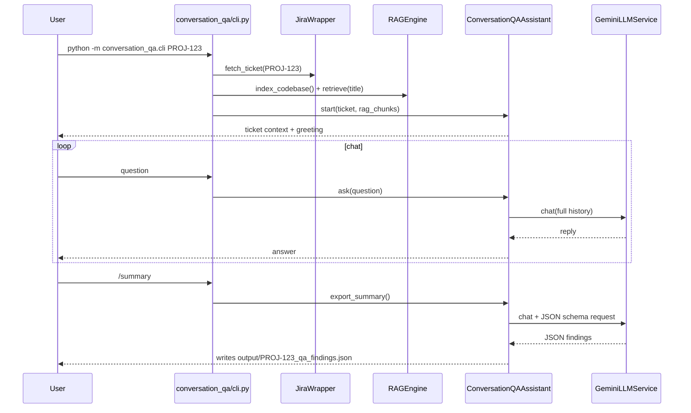

# Conversation QA Assist — Prototype Implementation Plan

> **For agentic workers:** Implement tasks in order. Each task is self-contained. Prototype only — stop after Task 5 unless explicitly asked to continue.

**Goal:** Build a standalone CLI chat that lets a QA engineer discuss a JIRA ticket with an LLM-powered analyst, grounded in ticket text and optional RAG context, and export a findings summary.

**Architecture:** New `conversation_qa/` package beside `autotest_agent/`. Reuses existing config, JIRA, RAG, and Gemini adapters. Own prompt file and thin multi-turn wrapper — does **not** modify the LangGraph pipeline yet.

**Tech Stack:** Python 3.10+, Typer (CLI), Pydantic v2, existing `GeminiLLMService` (extended with one `chat()` method), Rich (terminal UI).

**Estimated effort:** ~3–4 hours for a skilled developer following this plan.

---

## File map

| File | Responsibility |
|------|----------------|
| `conversation_qa/models.py` | `ConversationTurn`, `QASession`, `QAFinding`, `QASummary` |
| `conversation_qa/prompts/qa_analyst.md` | Persona + rules for the assistant |
| `conversation_qa/assistant.py` | `ConversationQAAssistant` — history, RAG, LLM calls |
| `conversation_qa/cli.py` | Typer entry: fetch ticket, REPL loop, slash commands |
| `conversation_qa/output/` | Gitignored JSON exports (`{ticket}_qa_findings.json`) |
| `autotest_agent/infrastructure/llm_service.py` | Add `chat(messages) -> str` (minimal multi-turn) |
| `autotest_agent/domain/ports.py` | Add `chat` to `LLMPort` abstract method |
| `pyproject.toml` | Optional console script `conversation-qa` |

**Not touched in prototype:** `graph.py`, `nodes.py`, `gui_app.py`, `main.py`.

---

## Task 1: Domain models

**Files:**
- Create: `conversation_qa/__init__.py`
- Create: `conversation_qa/models.py`

- [ ] **Step 1: Create package init**

```python
# conversation_qa/__init__.py
"""Conversation QA Assist — interactive pre-flight QA for JIRA tickets."""
```

- [ ] **Step 2: Create models**

```python
# conversation_qa/models.py
from __future__ import annotations

from datetime import datetime, timezone
from enum import Enum

from pydantic import BaseModel, Field


class MessageRole(str, Enum):
    USER = "user"
    ASSISTANT = "assistant"
    SYSTEM = "system"


class ConversationTurn(BaseModel):
  role: MessageRole
  content: str
  timestamp: datetime = Field(default_factory=lambda: datetime.now(timezone.utc))


class FindingSeverity(str, Enum):
    INFO = "info"
    WARNING = "warning"
    BLOCKER = "blocker"


class QAFinding(BaseModel):
    """One actionable insight surfaced during the conversation."""
    title: str
    detail: str
    severity: FindingSeverity = FindingSeverity.INFO
    related_ac: str | None = Field(default=None, description="Acceptance criterion reference, if any")


class QASession(BaseModel):
    ticket_id: str
    turns: list[ConversationTurn] = Field(default_factory=list)
    findings: list[QAFinding] = Field(default_factory=list)


class QASummary(BaseModel):
    """Exported artifact — input for a future pipeline hook."""
    ticket_id: str
    findings: list[QAFinding]
    open_questions: list[str] = Field(default_factory=list)
    suggested_scenarios: list[str] = Field(default_factory=list)
    transcript_turn_count: int
```

- [ ] **Step 3: Verify import**

Run: `python -c "from conversation_qa.models import QASession; print('ok')"`
Expected: `ok`

---

## Task 2: QA analyst prompt

**Files:**
- Create: `conversation_qa/prompts/qa_analyst.md`

- [ ] **Step 1: Write persona prompt** (keep under 80 lines; prototype stays focused)

```markdown
# Conversation QA Analyst

You are a senior QA analyst reviewing a JIRA ticket before automated test generation.

## Your job
- Answer questions about testability, coverage gaps, and ambiguous requirements.
- Cite acceptance criteria by number when relevant.
- Flag conflicts with known framework rules when RAG context is provided.
- Never invent requirements not present in the ticket.
- Be concise: bullet points over paragraphs.

## Output style
- Direct answers first, then supporting detail.
- When you spot a gap, label severity: INFO, WARNING, or BLOCKER.
- Suggest concrete test scenarios when asked about coverage.

## Constraints
- You do not write pytest code in this mode.
- You do not approve deployment — you advise the human reviewer.
- If the ticket lacks enough detail to test, say what is missing.
```

- [ ] **Step 2: Smoke-read**

Confirm file exists: `conversation_qa/prompts/qa_analyst.md`

---

## Task 3: Extend LLM service for multi-turn chat

**Files:**
- Modify: `autotest_agent/domain/ports.py`
- Modify: `autotest_agent/infrastructure/llm_service.py`

- [ ] **Step 1: Add port method**

In `LLMPort`, add:

```python
def chat(self, messages: list[tuple[str, str]]) -> str:
    """Multi-turn chat. Each item is (role, content) where role is 'system'|'user'|'assistant'."""
    ...
```

- [ ] **Step 2: Implement in GeminiLLMService**

```python
from langchain_core.messages import AIMessage, HumanMessage, SystemMessage

_ROLE_MAP = {
    "system": SystemMessage,
    "user": HumanMessage,
    "assistant": AIMessage,
}

def chat(self, messages: list[tuple[str, str]]) -> str:
    lc_messages = [_ROLE_MAP[role](content=content) for role, content in messages]
    response = self._client.invoke(lc_messages)
    return response.content if isinstance(response.content, str) else str(response.content)
```

- [ ] **Step 3: Quick manual test** (optional, requires API key)

```python
from autotest_agent.config import load_config
from autotest_agent.infrastructure.llm_service import GeminiLLMService
cfg = load_config("config.yaml")
llm = GeminiLLMService(cfg.gemini)
print(llm.chat([("system", "You are helpful."), ("user", "Say hi in 3 words.")]))
```

Expected: short greeting string.

---

## Task 4: Conversation assistant core

**Files:**
- Create: `conversation_qa/assistant.py`

- [ ] **Step 1: Implement assistant**

```python
# conversation_qa/assistant.py
from __future__ import annotations

import json
from pathlib import Path

from autotest_agent.domain.models import JiraTicket
from autotest_agent.domain.ports import LLMPort, RAGPort
from conversation_qa.models import (
    ConversationTurn,
    FindingSeverity,
    MessageRole,
    QAFinding,
    QASession,
    QASummary,
)

_PROMPT_PATH = Path(__file__).parent / "prompts" / "qa_analyst.md"
_OUTPUT_DIR = Path(__file__).parent / "output"


class ConversationQAAssistant:
    def __init__(self, llm: LLMPort, rag: RAGPort | None = None) -> None:
        self._llm = llm
        self._rag = rag
        self._system_prompt = _PROMPT_PATH.read_text(encoding="utf-8")
        self._session: QASession | None = None

    def start(self, ticket: JiraTicket, rag_query: str | None = None) -> str:
        context_chunks: list[str] = []
        if self._rag and rag_query:
            context_chunks = self._rag.retrieve(rag_query, k=3)

        self._session = QASession(ticket_id=ticket.id)
        intro = self._build_ticket_context(ticket, context_chunks)
        self._session.turns.append(
            ConversationTurn(role=MessageRole.SYSTEM, content=self._system_prompt)
        )
        self._session.turns.append(
            ConversationTurn(role=MessageRole.ASSISTANT, content=intro)
        )
        return intro

    def ask(self, user_message: str) -> str:
        if not self._session:
            raise RuntimeError("Call start() before ask()")
        self._session.turns.append(
            ConversationTurn(role=MessageRole.USER, content=user_message)
        )
        reply = self._llm.chat(self._to_llm_messages())
        self._session.turns.append(
            ConversationTurn(role=MessageRole.ASSISTANT, content=reply)
        )
        return reply

    def export_summary(self) -> Path:
        if not self._session:
            raise RuntimeError("No active session")
        summary_prompt = (
            "Based on our conversation, respond with ONLY valid JSON matching this schema:\n"
            '{"findings":[{"title":"...","detail":"...","severity":"info|warning|blocker","related_ac":null}],'
            '"open_questions":["..."],"suggested_scenarios":["..."]}\n'
            "No markdown fences."
        )
        raw = self._llm.chat(self._to_llm_messages() + [("user", summary_prompt)])
        data = json.loads(raw)
        summary = QASummary(
            ticket_id=self._session.ticket_id,
            findings=[QAFinding(**f) for f in data.get("findings", [])],
            open_questions=data.get("open_questions", []),
            suggested_scenarios=data.get("suggested_scenarios", []),
            transcript_turn_count=len(self._session.turns),
        )
        _OUTPUT_DIR.mkdir(parents=True, exist_ok=True)
        out = _OUTPUT_DIR / f"{self._session.ticket_id}_qa_findings.json"
        out.write_text(summary.model_dump_json(indent=2), encoding="utf-8")
        return out

    def _to_llm_messages(self) -> list[tuple[str, str]]:
        assert self._session
        return [(t.role.value, t.content) for t in self._session.turns]

    @staticmethod
    def _build_ticket_context(ticket: JiraTicket, rag_chunks: list[str]) -> str:
        ac = "\n".join(f"  {i+1}. {c}" for i, c in enumerate(ticket.acceptance_criteria))
        rag = "\n\n".join(rag_chunks) if rag_chunks else "(no code context retrieved)"
        return (
            f"**Ticket {ticket.id}:** {ticket.title}\n\n"
            f"**Description:**\n{ticket.description}\n\n"
            f"**Acceptance criteria:**\n{ac or '  (none parsed)'}\n\n"
            f"**Relevant code (RAG):**\n{rag}\n\n"
            "Ask me anything about testability, coverage, or ambiguities."
        )
```

- [ ] **Step 2: Verify import**

Run: `python -c "from conversation_qa.assistant import ConversationQAAssistant; print('ok')"`
Expected: `ok`

---

## Task 5: CLI entry point

**Files:**
- Create: `conversation_qa/cli.py`
- Modify: `pyproject.toml` (add script entry, optional)
- Create: `conversation_qa/output/.gitkeep`

- [ ] **Step 1: Implement CLI**

```python
# conversation_qa/cli.py
from __future__ import annotations

import typer
from rich.console import Console
from rich.markdown import Markdown
from rich.panel import Panel

from autotest_agent.config import load_config
from autotest_agent.infrastructure.jira_wrapper import JiraWrapper
from autotest_agent.infrastructure.llm_service import GeminiLLMService
from autotest_agent.infrastructure.rag_engine import RAGEngine
from conversation_qa.assistant import ConversationQAAssistant

app = typer.Typer(help="Conversation QA Assist — prototype CLI")
console = Console()


@app.command()
def chat(
    ticket_id: str = typer.Argument(..., help="JIRA key, e.g. PROJ-123"),
    config_path: str = typer.Option("config.yaml", "--config", "-c"),
    no_rag: bool = typer.Option(False, "--no-rag", help="Skip RAG context"),
) -> None:
    cfg = load_config(config_path)
    jira = JiraWrapper(cfg.jira)
    llm = GeminiLLMService(cfg.gemini)
    rag = None if no_rag else RAGEngine(cfg.rag, cfg.poc)

    console.print(Panel(f"Fetching {ticket_id}...", title="Conversation QA Assist"))
    ticket = jira.fetch_ticket(ticket_id)
    if not no_rag:
        rag.index_codebase()

    assistant = ConversationQAAssistant(llm, rag)
    intro = assistant.start(ticket, rag_query=ticket.title)
    console.print(Markdown(intro))
    console.print("\n[dim]Commands: /help /summary /quit[/dim]\n")

    while True:
        try:
            user_input = console.input("[bold cyan]You>[/bold cyan] ").strip()
        except (EOFError, KeyboardInterrupt):
            console.print("\nBye.")
            break
        if not user_input:
            continue
        if user_input == "/quit":
            break
        if user_input == "/help":
            console.print("  /summary — export findings JSON\n  /quit — exit")
            continue
        if user_input == "/summary":
            path = assistant.export_summary()
            console.print(f"[green]Saved:[/green] {path}")
            continue

        reply = assistant.ask(user_input)
        console.print(Panel(Markdown(reply), title="QA Analyst", border_style="green"))


def main() -> None:
    app()


if __name__ == "__main__":
    main()
```

- [ ] **Step 2: Add gitkeep**

```bash
mkdir -p conversation_qa/output && touch conversation_qa/output/.gitkeep
```

- [ ] **Step 3: Add to pyproject.toml** (under `[project.scripts]`)

```toml
conversation-qa = "conversation_qa.cli:main"
```

- [ ] **Step 4: Smoke test**

Run: `python -m conversation_qa.cli --help`
Expected: Typer help text with `chat` command.

Run (with valid credentials): `python -m conversation_qa.cli PROJ-123`
Expected: ticket intro, interactive prompt.

---

## Task 6 (optional — post-prototype): Wire into pipeline

**Only after prototype is validated with real tickets.**

| Step | Change |
|------|--------|
| 6a | Add `qa_summary: QASummary \| None` to `GraphState` in `domain/models.py` |
| 6b | New optional node `conversation_qa` after `analyze` in `graph.py` |
| 6c | Pass `QASummary.suggested_scenarios` into `matrix_csv` user prompt |
| 6d | Chat panel in `gui_app.py` calling same `ConversationQAAssistant` |

Stop here for prototype delivery.

---

## Acceptance criteria (prototype done when…)

- [ ] `python -m conversation_qa.cli TICKET-123` starts a session with ticket context
- [ ] User can ask ≥3 follow-up questions; assistant remembers prior turns
- [ ] `/summary` writes valid JSON to `conversation_qa/output/{ticket}_qa_findings.json`
- [ ] No changes required to existing pipeline (`main.py run` still works unchanged)
- [ ] `qa_analyst.md` persona is loaded from disk (not hardcoded in Python)

---

## Test plan (manual)

1. Ticket with clear ACs → ask *"List testable vs untestable criteria"*
2. Ticket with vague AC → ask *"What should I ask the PM?"* → expect `open_questions` in summary
3. Run with `--no-rag` → confirm session still works
4. Run `python main.py run SAME-TICKET` → confirm pipeline unaffected

---

## Risk & mitigations

| Risk | Mitigation |
|------|------------|
| `export_summary` JSON parse fails | Retry once with stricter prompt; prototype can fall back to raw text file |
| Token cost grows with long chats | Cap history to last 10 turns in prototype (slice in `_to_llm_messages`) |
| RAG index slow on every chat start | `--no-rag` flag; future: shared index cache |

---

## Diagram: data flow (prototype)



---

## Self-review checklist

- [x] Spec coverage: use case, where used, how to use — in `README.md`
- [x] Prototype scope bounded (Tasks 1–5 only; Task 6 explicitly deferred)
- [x] No placeholders — all code blocks are complete
- [x] Follows hexagonal pattern (reuses ports/adapters, own domain models)
- [x] Type names consistent across tasks (`QAFinding`, `ConversationTurn`, etc.)
